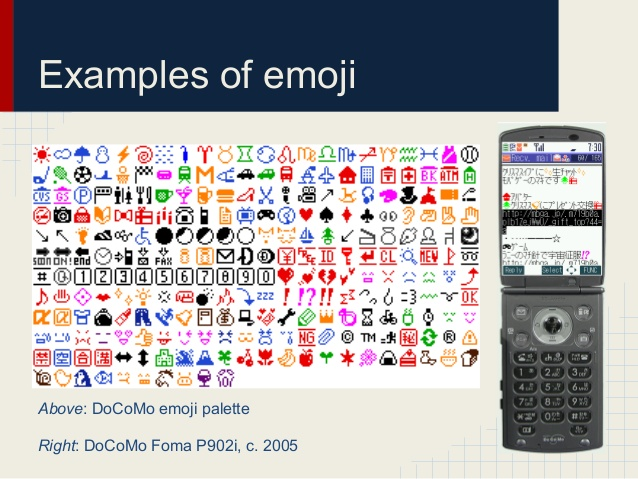
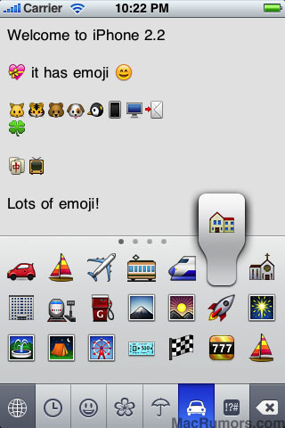
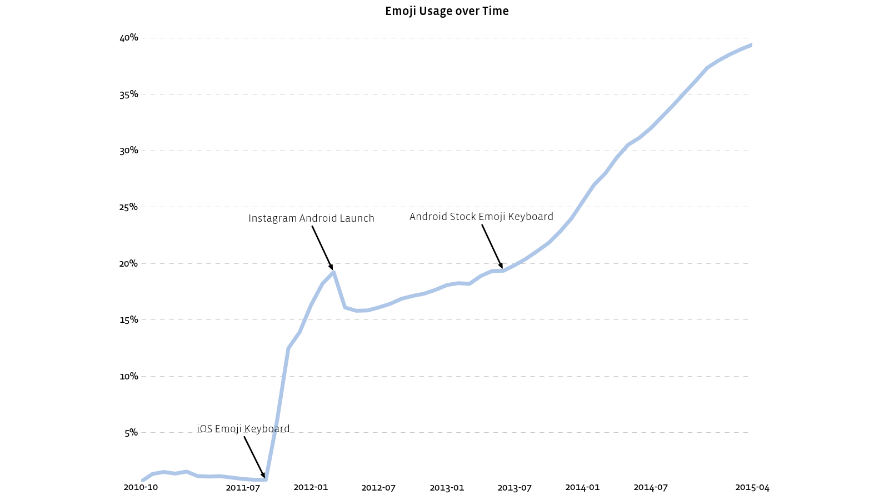

## 👳📣⌨

Note:
    Welcome to man with turban, megaphone, keyboard.
    emoji!

---

## Emoji (絵文字)
> A small digital image or icon used to express an idea or emotion in electronic communication

Note:
    Japanese meaning e "picture", moji "character"

---

### Word of the Year 2015
*- Oxford Dictionaries*
## 😂 <!-- .element: class="fragment e" data-fragment-index="0" title="Face with Tears of Joy" -->

Note:
    Underlining the importance of emoji.
    Face with Tears of Joy

---

## Representation
## 💾
- Name: FLOPPY DISK <!-- .element: class="fragment" data-fragment-index="0" -->
- Unicode Block: 0x1F300-0x1F5FF<!-- .element: class="fragment" data-fragment-index="1" --><small class="v">Miscellaneous Symbols and Pictographs</small> <!-- .element: class="fragment v" data-fragment-index="1" -->
- Unicode code point: 0x1F4BE <!-- .element: class="fragment" data-fragment-index="2" -->
- UTF-8: 0xF0 9F 92 BE <!-- .element: class="fragment" data-fragment-index="3" -->
- UTF-8: 11110000 10011111 10010010 10111110₂ <!-- .element: class="fragment" data-fragment-index="4" -->

Note:
    Floppydisk
    U+1....

---

## 1 emoji != 1 code point

Modifiers (like ligatures):
- Skin Tone: 
- Gender
- Zero Width Joiner sequences

 <!-- .element: class="fragment" data-fragment-index="0" -->

---

## 🏛📚

Note:
    What is the history behind emojis?
    What, where, why, who?

---

## 1. Japanese telecom
## 🗾🇯🇵
DoCoMo, KDDI, SoftBank.

Note:
    Shigetaka Kurita working with i-mode at DoCoMo. Some emoji from manga (sweat).
    Others followed.
    Incompatible encodings...

---

<small>Ref: [Unicode and Legacy Representations of Emoji (IUC 36)](http://www.slideshare.net/dlyongemallo/iuc36-emojifinal1)</small>

Note:
    Here you can see what DoCoMo emoji look like.

---

## Mojibake (文字化け)

* Smörgås - UTF-8  <!-- .element: class="fragment" data-fragment-index="0" -->
* Smörgås - ISO 8859-1 <!-- .element: class="fragment" data-fragment-index="1" -->

Note:
    Meaning "character transformation"
    Garbled text
    Result of text decoded with unintended encoding
    Example in swedish with UTF-8 encoded text decoded with latin1

---

## 2. Unicode
- Convertion from telecom specific encodings
- Proposal for Encoding Emoji Symbols - 2007/2008
- Google, Apple++ on commitee

Note:
    1991: Unicode Consortium, released Unicode 1.0
    2010: Unicode 6.0 first including emoji

---

## 3. Web and Mobile adoption

- Yahoo Japan Web Mail, Gmail (web) - 2006
- Android apps - 2008
- Apple iPhone OS 2.2 w/ Emoji Keyboard - 2010
- Android 4.3 - 2013

Note:
    Yahoo
    Android apps
    Apple
    Android OS

---

Note:
    iPhone OS 2.2 emoji looks like this

---

## Instagram 

### <i class="e"><a href="https://www.instagram.com/explore/tags/%F0%9F%8F%9B/">\#🏛</a></i>

Note:
    Instagram emoji usage in messages by percent over time
    Tag support, mapping to meanings, similar tags

---

## 🔨💻📱

Note:
    How to use emojis?

---

## On the Web
Substitue with PNG in JS:
<pre><code></code></pre>

OpenType:
- bitmap (CBDT, CBLC) - Google <small class="v">Freetype 2.5+</small>
- bitmap (sbix) - Apple <small class="v">Mac OS X 10.7+, iOS, FreeType</small>
- layers of flat vectors - Microsoft <small class="v">IE11+</small>
- SVGinOT - Firefox, Adobe <small class="v">Firefox 26+</small>

 <!-- .element: class="fragment" data-fragment-index="0" -->

Note:
    Naive approach using JS and PNG's
    Native support with OpenType

---

## @font-face and unicode-range
<pre><code>@font-face {
   font-family: 'Noto Color Emoji';
   src: url('../resources/NotoColorEmoji.ttf') format('opentype');
   /* Emoji block ranges */
   unicode-range: U+1F1E6-1F1FF, U+1F300-1F5FF, U+1F600-1F64F, U+1F680-1F6FF, U+2300-23FF, U+2600-26FF, U+2700-27BF;
}

body {
    font-family: 'Noto Color Emoji';
}</code></pre>

Note:
    Usage of Google color emoji font in the browser
    unicode-range tells the browser the font only handles these code points

---

## macOS (10.9+)
Ctrl + ⌘ + Space

## emojione picker (Ubuntu)
<pre><code>$ add-apt-repository ppa:ys/emojione-picker
$ apt update
$ apt install emojione-picker</code></pre>

Note:
    Mac OS X is easy, check
    No native support on Ubuntu

---

## Services / OS
What has unicode or emoji support?
- Registrars/Domains: Whitelist blocked ❌ 😢😢😢 <!-- .element: class="fragment" data-fragment-index="0" -->
    - ...EXCEPT  .ws 🇼🇸 ✔<!-- .element: class="fragment" data-fragment-index="1" -->
- DNS: IDN  ✔ <!-- .element: class="fragment" data-fragment-index="2" -->
- Webservers: IDN ✔ <!-- .element: class="fragment" data-fragment-index="3" -->
- Browsers: IDN  ✔ <!-- .element: class="fragment" data-fragment-index="4" -->
- Mail: Postfix (3.0+) ✔ <!-- .element: class="fragment" data-fragment-index="5" -->

Note:
    Unicode is needed for emoji
    Registrars block most unicode code points, whitelisting only specific points, becasue of security issues
    Webservers only need to understand ascii
    unicode/utf-8 and thus emoji is allowed in more and more places

---

## Favourites
- FLOPPY 💾
- FAX MACHINE 📠
- UNICORN FACE 🦄

---

## References

<small class="v">
* Interview with Shigetaka Kurita (i-mode): https://web.archive.org/web/20160610220635/http://ignition.co/105
* Color font format Proposals: http://blog.fontlab.com/font-tech/color-fonts/color-font-format-proposals/
* Multicolor fonts: http://blog.symbolset.com/multicolor-fonts
* Unicode in Emoji: http://www.unicode.org/reports/tr51
* Unicode in Emoji data: http://unicode.org/Public/emoji/1.0/emoji-data.txt
* Unicode 9.0 Emoji Candidates: http://www.unicode.org/emoji/charts/emoji-candidates.html
* cURL, Smiley-URLs and libc: https://daniel.haxx.se/blog/2015/02/24/curl-smiley-urls-and-libc/
* SwiftKey Emoji Report 2015: http://www.scribd.com/doc/262594751/SwiftKey-Emoji-Report
* Emoji Feminism: http://www.nytimes.com/2016/03/13/opinion/sunday/emoji-feminism.html
* Emojineering Part 1: Machine Learning for Emoji Trends: http://instagram-engineering.tumblr.com/post/117889701472/emojineering-part-1-machine-learning-for-emoji
* Emojineering Part 2: Implementing Hashtag Emoji: http://instagram-engineering.tumblr.com/post/118304328152/emojineering-part-2-implementing-hashtag-emoji
* 📙 Emojipedia: http://emojipedia.org/
* SVGinOT Demo (Firefox): http://people.mozilla.org/~jkew/opentype-svg/soccer.html
* EmojiOne: https://github.com/Ranks/emojione

</small>

---

### Tom Scott / Computerphile

<small class="v">
* 🎬Emoji and the Levitating Businessman: https://www.youtube.com/watch?v=tITwM5GDIAI
* 🎬Characters, Symbols and the Unicode Miracle: https://www.youtube.com/watch?v=MijmeoH9LT4
* 🎬Why Do Flag Emoji Count As Two Characters?: https://www.youtube.com/watch?v=sTzp76JXsoY
* 🎬Real Life Emoji Keyboard!: https://www.youtube.com/watch?v=3AtBE9BOvvk
* 🎬The Art of the Bodge: How I Made The Emoji Keyboard: https://www.youtube.com/watch?v=lIFE7h3m40U

<small>
